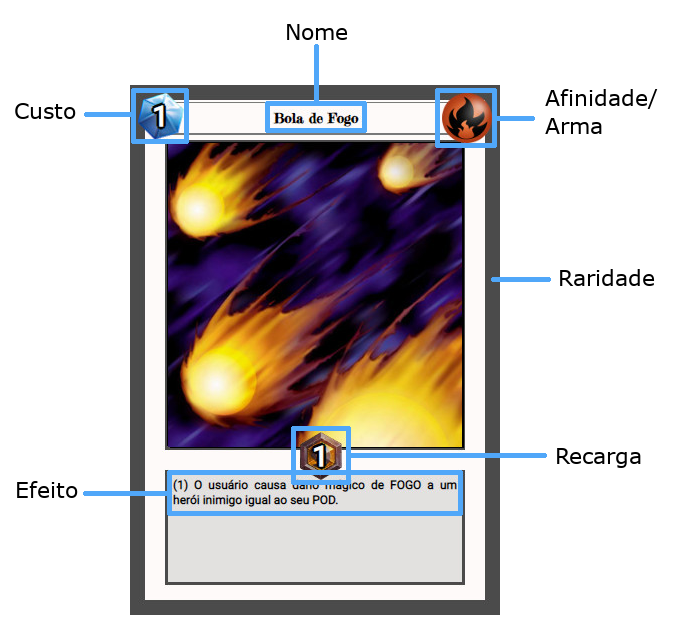
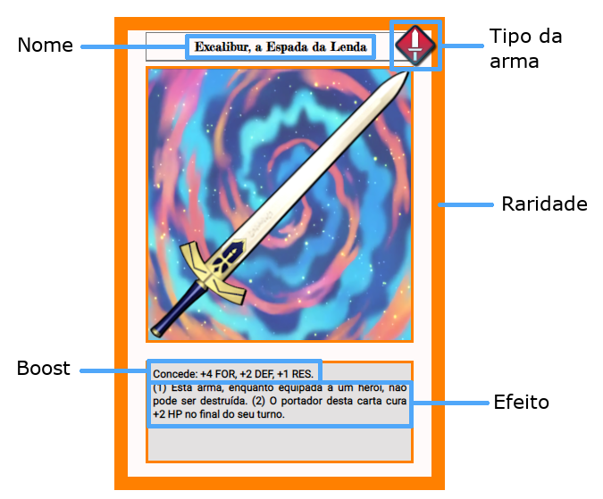

# Neverland Heroes 

 
## Detalhes

- Este projeto foi feito como parte de um trabalho para a disciplina de Laboratório de Engenharia de Software da faculdade. Nele devíamos utilizar várias tecnologias em conjunto, como back-end, front-end e banco de dados, além dos diagramas da UML. Eu decidi fazer um jogo de cartas estilo TCG, como Hearthstone ou Yu-gi-oh. 
- A parte do back-end foi feito com Java, o banco de dados foi feito em SQL Server e o front-end foi feito com HTML, CSS e JavaScript raiz.
- Como eu era menino novo quando codei esse jogo não apliquei Patterns nem Clean Code, então o código tá uma bela (não tão bela) de uma massaroca 😔.

## Descrição

Nesse jogo é possível criar uma conta, ganhar cartas e jogar (jura?). Existem mais de 100 cartas divididas em 5 grupos: heróis, armas, magias, consumíveis e posturas, cada uma tendo suas próprias particularidades. Como são muuuitas regras e informações, não vou escrever tudo aqui, mas elas podem ser visualizadas na tela de ajuda dentro do jogo, que por acaso está disponível cruzinha nesse arquivo [aqui](https://github.com/Scalibacon/LES-CardGame/blob/master/WebContent/ajuda.jsp), mas vou deixar um resuminho aqui também.

## Resuminho aqui também

As partidas são disputadas entre 2 jogadores e vence aquele que deixar o campo do adversário sem nenhuma carta de herói. Cada baralho deve ter 1 campeão, que nada mais é do que um herói que já vai começar no seu campo. Cartas de magia devem ser usadas por um herói em campo e que tenha a mesma afinidade elemental EEEE mana suficiente. Heróis podem ser equipados por 1 carta de arma, que deve ser do mesmo tipo mostrado na carta do herói. Não vou falar tudo aqui se não vai virar um livro, mas vou deixar algumas imagens que ilustram bem como funciona o jogo.

### Exemplo de herói

                                                                         

### Exemplo de magia

### Exemplo de arma

## Tá, mas e aí?

Infelizmente esse projeto não pôde ver a sua conclusão. A apresentação do trabalho foi adiantada, então algumas features que ainda faltavam ser implementadas não foram (e eu não ia fazer isso durante as minhas férias u.u). Mas como foi um erro no cronograma da aula esses detalhes foram relevados e deu pra tirar aquele 10 gostosinho. Só que... como eu disse, o código tá bem emaranhado e asqueroso, então dar manutenção ou adicionar as funções que restaram ficou beeem difícil. E por isso não finalizei esse jogo. 2 meses depois não entendia quase nada do que tinha escrito kkk.
